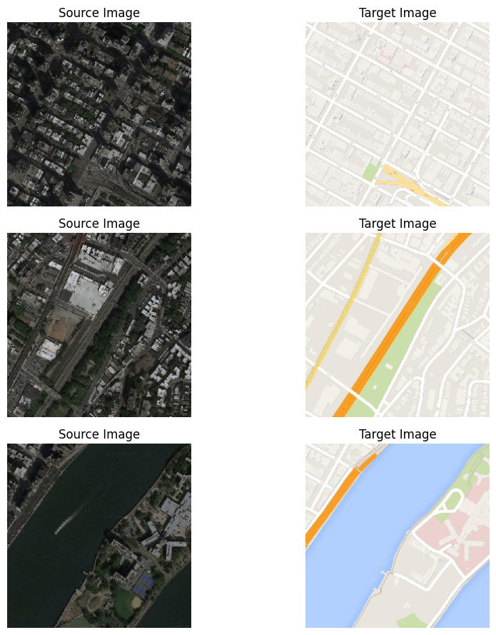
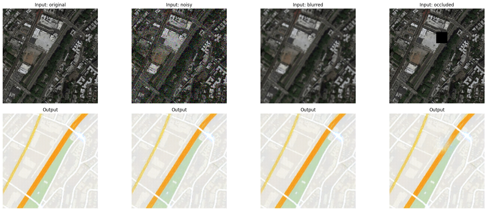
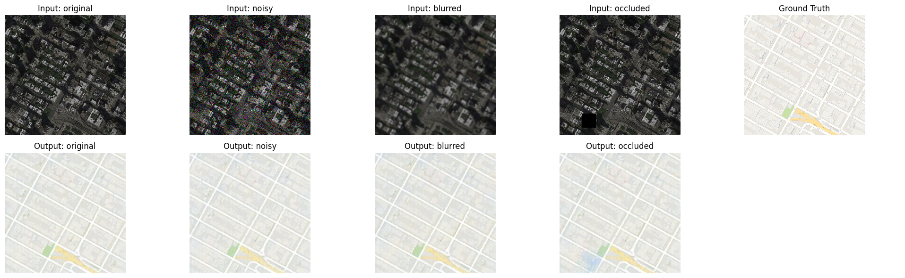

# Satellite-to-Map-Translation-Robustness-Evaluation

# **1. Project Overview**
This project leverages the Pix2Pix GAN framework to translate satellite images into high-resolution map images. It is designed for applications in urban planning, disaster response, and geospatial analysis. In this updated version, we evaluate the **trustworthiness** of the model under **real-world distortions** to ensure robustness and reliability.

<br>



## Objective

- Build a deep learning model that can translate satellite imagery into accurate map representations.
- Evaluate the **robustness** of the model by testing its performance under common real-world image distortions such as Gaussian noise, blur, and occlusion.
- Use **PSNR** and **SSIM** to quantitatively measure visual fidelity and structural similarity of outputs.

## Trustworthiness Focus: Reliability and Robustness

We evaluated the model’s robustness using:

- **Gaussian noise** (σ ≈ 0.1)
- **Gaussian blur** (kernel size: 5×5)
- **Occlusion** (random 30×30 pixel blocks)

The model maintained PSNR > 30 and SSIM > 0.81 across all test conditions, proving resilience to noise and degradation.

**Metrics Used**:
- **PSNR**: Peak Signal-to-Noise Ratio
- **SSIM**: Structural Similarity Index

---

# **2. Repository Structure**
The repository is structured as follows:

```bash
.
├── README.md
├── Images
│   ├── sample_images
│   └── output_images
└── Code.ipynb
```


---

# **3. Dataset** 
- **Dataset Link: https://efrosgans.eecs.berkeley.edu/pix2pix/datasets/maps.tar.gz** 

The dataset used in this project consists of **satellite images of cities**, obtained via **web scraping from Google Maps**. It is publicly available and provided by **UC Berkeley’s Electrical and Computer Science Department**.

### Dataset Information
- **Total Images (Train + Validation):** **2,194**
- **Image Format:** Each sample consists of a **concatenated pair of images**, where one half is a **satellite image**, and the other half is a **corresponding map image**.
- **Image Dimensions:**  
  - Each **concatenated image** is **1200 x 600 pixels**  
  - This means each **individual image (either a satellite or map image) is 600 x 600 pixels**
- **Total Dataset Size:** **~257.7 MB**

---

# **4. Environment & Dependencies**
### **Hardware Used**
- **Google Colab with NVIDIA T4 GPU**
- RAM: 16GB
- CUDA enabled for accelerated training

### **Libraries Used**
- **Python**: 3.8+
- **PyTorch**: 1.13.0+
- **torchvision**: 0.14.0+
- **TensorFlow**: 2.8.0+ (optional, for additional evaluation tasks)
- **scikit-image**: 0.19.0+ (used for PSNR and SSIM metric computation)
- **OpenCV**: 4.5.5+ (for applying noise, blur, and occlusion)
- **NumPy**: 1.21.0+ (for array computations)
- **Matplotlib**: 3.5.0+ (for generating visual plots)
- **tqdm**: 4.62.3 (for showing training and evaluation progress)
- **glob**: Standard Python library (for file path handling)
- **random**: Standard Python library (for random distortion generation)

---

# **5. Model Architecture**

## **5.1 Generator: U-Net Based Image Translation**

The **Generator** uses a **U-Net architecture**, a specialized **Encoder-Decoder** model with **skip connections** that help preserve spatial information during transformation. Unlike traditional GANs that map random noise to images, here the generator performs **image-to-image translation** directly.

- **Input**: Satellite images
- **Output**: Corresponding map images
- **Image size**: 256x256

### **5.1.1 Encoder-Decoder Structure**

- **Encoder**: Extracts important features from the input image using convolutional layers, downsampling the data to a **1024-dimensional latent space**.
- **Decoder**: Uses transpose convolutions to reconstruct a translated image from the latent representation.

### **5.1.2 Skip Connections**

- **Skip connections** directly link encoder layers to corresponding decoder layers.
- They help the network:
  - Retain fine details (edges, shapes)
  - Improve training stability
  - Maintain structural integrity during translation


## **5.2 Discriminator: CNN-Based Classifier**

The **Discriminator** is a deep **Convolutional Neural Network (CNN)** that classifies whether an image is **real** (from the dataset) or **fake** (generated).

- **Input**: Pairs of satellite and map images
- **Architecture**:
  - Multiple convolutional layers with **LeakyReLU activations**
  - Batch normalization for training stability
  - Final sigmoid layer outputs a probability (real or fake)

- **Role**:
  - Provides adversarial feedback to the generator
  - Helps improve the realism and quality of the generated maps


### **5.2.1 Architecture Overview**

- A series of **convolutional layers** progressively extract image features like edges, textures, and structures.
- **LeakyReLU activations** are used to avoid dead neurons.
- **Batch Normalization** stabilizes and speeds up training.
- **Strided convolutions** reduce spatial dimensions instead of pooling layers.

- Final layers:
  - The extracted features are **flattened** into a vector.
  - A **dense (fully connected) layer** predicts the probability of the input being real or fake.
  - The **Sigmoid activation** outputs a value between 0 (fake) and 1 (real).

### **5.2.2 Functionality in Adversarial Training**

- The Discriminator is trained to distinguish between:
  - **Real images** (ground truth maps)
  - **Fake images** (maps generated by the Generator)
  
- **Loss Function**: Binary Cross-Entropy Loss is used to measure classification error.

- During adversarial training:
  - The **Generator improves** by trying to fool the Discriminator.
  - The **Discriminator improves** by better identifying fake images.

- This adversarial process **forces the Generator to create highly realistic outputs** over time.

---

# **6. Trustworthiness and Security Focus**

In this project, we emphasize the **Reliability and Robustness** aspect of AI trustworthiness.  
Our goal was to ensure that the model remains dependable even when encountering imperfect or corrupted input data — a common occurrence in real-world satellite imaging.


## **6.1 Trustworthiness Aspect Evaluated**

- **Reliability**: The model consistently produces accurate and structurally sound outputs even when facing distortions like noise, blur, or occlusion.
- **Robustness**: The model maintains high quantitative performance (PSNR > 30, SSIM > 0.81) across various perturbations.
- **Security Awareness**: Testing against occlusion mimics scenarios like adversarial hiding of features (e.g., cloud cover or intentional interference).


## **6.2 Methodology**

- **Perturbation Testing**: We applied realistic distortions to input satellite images.
- **Metric-Based Evaluation**: Used PSNR and SSIM to measure output fidelity and perceptual quality.
- **Visual Inspection**: Compared corrupted inputs and generated outputs to ground truth maps.


## **6.3 Key Findings**

- The Generator's outputs remained visually and structurally faithful across all distortion types.
- Even with missing or blurred regions, the model preserved overall spatial alignment and map usability.
- This confirms that the model meets a **high reliability standard**, making it suitable for critical applications like urban planning, emergency response, and navigation systems.


<br>



---


# **7. Robustness Evaluation**

To evaluate the **trustworthiness** of the model, we tested its ability to maintain output quality under common real-world distortions.

## **7.1 Distortions Applied**

The following perturbations were introduced to the satellite input images:

- **Gaussian Noise**:  
  - Mean = 0
  - Variance (σ²) ≈ 0.01  
  - Simulates sensor noise and environmental interference.

- **Gaussian Blur**:  
  - Kernel size = (5×5)  
  - Simulates atmospheric distortion, motion blur, or defocus in satellite captures.

- **Occlusion**:  
  - Random black square of size 30×30 pixels  
  - Simulates missing regions (e.g., cloud cover, shadows).


## **7.2 Quantitative Metrics**

The model was evaluated using:

- **PSNR** (Peak Signal-to-Noise Ratio): Measures the fidelity of pixel values between the output and the ground truth. Higher is better.
- **SSIM** (Structural Similarity Index Measure): Measures perceptual and structural similarity. Closer to 1 is better.

| Distortion | PSNR (dB) | SSIM |
|------------|-----------|------|
| Original   | 31.10     | 0.8356 |
| Noisy      | 30.57     | 0.8191 |
| Blurred    | 30.76     | 0.8254 |
| Occluded   | 30.74     | 0.8292 |


## **7.3 Observations**

- The **PSNR remained above 30 dB** across all types of distortions, indicating high pixel fidelity even when inputs were corrupted.
- The **SSIM stayed consistently above 0.81**, showing that the generated maps preserved critical spatial structures.
- The model showed strong **resilience against moderate levels of noise, blur, and missing data** — a key requirement for real-world deployment in fields like disaster management and urban planning.


## **7.4 Visual Results**

Below is a sample visualization demonstrating robustness:
<br>



---


# **8. Future Improvements**

- Extend to **multi-modal satellite inputs** (infrared, night-time, elevation data).
- Perform **adversarial robustness testing** to simulate attacks and defenses.
- Train on **higher-resolution images** (512x512 or 1024x1024) for finer map detail.
- Integrate **explainable AI techniques** (e.g., Grad-CAM) to improve model interpretability.
- Optimize for **real-time satellite-to-map conversion** for smart city applications and edge devices.


# **9. Conclusion**

In this project, we successfully developed a **Pix2Pix GAN-based model** for translating satellite images into corresponding map images.

Key achievements:

- Achieved **high visual and structural fidelity** across various input distortions (Gaussian noise, blur, occlusion).
- Demonstrated **robustness** with PSNR consistently above 30 dB and SSIM above 0.81 across test conditions.
- Evaluated the model’s **trustworthiness** under realistic, real-world perturbations, focusing on **reliability and robustness**.
- Validated model outputs through both **quantitative metrics** and **visual inspections**.
- Proposed future enhancements to further improve scalability, resilience, and explainability.
